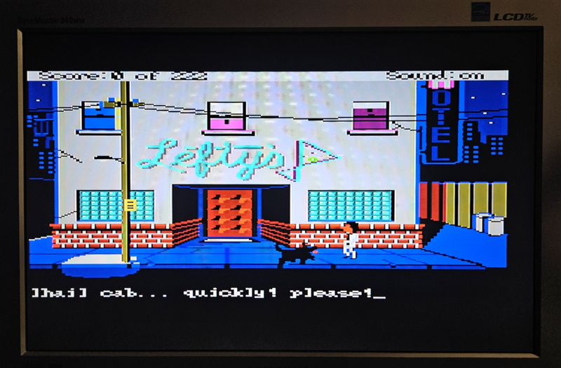
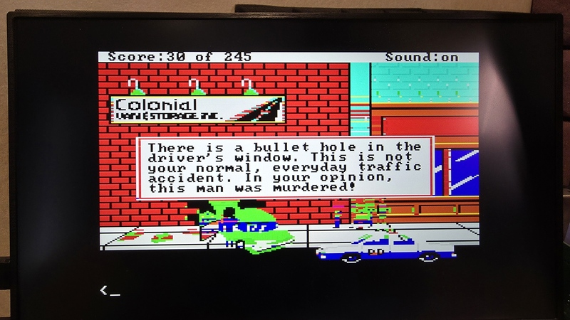
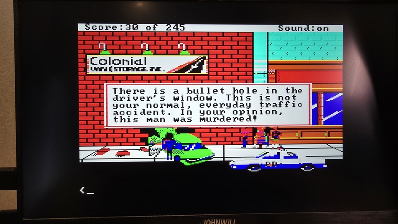

# PC1-BMP

**BMP Image Viewer Suite for Olivetti Prodest PC1**

A collection of BMP image viewers for the Olivetti Prodest PC1, ranging from a simple native-mode viewer to advanced versions that use real-time V6355D palette reprogramming to display more colors than the hardware normally allows.


## Programs

### PC1-BMP — Native 160×200×16 Viewer

The baseline viewer. Displays 4-bit BMP images using the PC1's hidden 160×200×16 graphics mode. Supports 160×200 (native) and 320×200 (auto-downscaled) BMPs.

- C64-style loading effects (border flashing, color cycling, completion flash)
- PERITEL.COM compatible (preserves horizontal position)
- Press any key to exit

```
PC1-BMP filename.bmp
```


*Example images displayed with the native 160×200×16 viewer:*




### PC1-BMP2 — Flip-First Technique

Uses the flip-first optimization: the palette flip is the very first instruction after HBLANK detection, calibrated at nanosecond precision. All subsequent palette writes target only INACTIVE entries, pre-loading for the next same-parity line (N+2).

This eliminates virtually all flicker — the only remaining artifact is on the first scanline at the top of the screen. Combined with stability-based color reordering and skip optimization, this achieves 3 independent colors per scanline with near-zero flicker.

- **3 independent colors per scanline** — best color fidelity
- **Flip-first**: palette switch before palette write = near-zero flicker
- **N+2 pre-loading**: inactive entries loaded for next same-parity line
- Stability reorder: most stable color → highest entry (maximizes skips)
- Skip optimization: lines where top3[N+2] == top3[N] get zero writes
- Controls: ESC=exit, H=toggle HSYNC, V=toggle VSYNC

```
PC1-BMP2 filename.bmp
```



### PC1-BMP3 — Flip-First + Dithering

Same flip-first engine as PC1-BMP2, with four switchable dithering modes for enhanced color approximation. Dithering is applied at render time — no BMP modification needed.

- **Mode 1 — None**: Direct XLAT nearest-color mapping (same as BMP2)
- **Mode 2 — Bayer 4×4**: Ordered dithering with spread=32 (±16 threshold range)
- **Mode 3 — 1D Error Diffusion**: Horizontal-only scanline error diffusion (err/2 right)
- **Mode 4 — Sierra 2×2 Stipple** ⭐: Precomputed color-pair checkerboard — best results
- Controls: ESC=exit, 1/2/3/4=dithering mode, H=toggle HSYNC, V=toggle VSYNC

```
PC1-BMP3 filename.bmp
```



### PC1-BMP4 — Flip-First with 512-Color Support ⭐ (Best Quality)

**The recommended image viewer.** Evolution of PC1-BMP2 with support for **8-bit (256-color) BMPs**, unlocking the full V6355D 512-color space (3 bits per R/G/B channel = 8×8×8 = 512 colors). Also supports 4-bit BMPs for backward compatibility.

With 8-bit palettes, images can draw from up to 256 unique colors across the full 512-color V6355D gamut. Each scanline still selects the 3 best + black, but using a much richer global palette dramatically improves image quality.

- **4-bit and 8-bit BMP support** — up to 256 palette entries
- **Full V6355D 512-color space** — RGB333 (8 levels per channel)
- **Auto-detected background** — darkest palette entry used as background (index 0 need not be black)
- Same flip-first engine, stability reorder, and skip optimization as BMP2
- ANSI-colored splash screen with loading progress (border cycling)
- Exit info screen: BMP format, bit depth, palette capacity, unique colors
- Controls: ESC=exit (shows image info)

```
PC1-BMP4 filename.bmp
```


### Old Versions

Earlier development versions are preserved in the `Old Versions/` folder with descriptive names documenting the evolution of techniques:

- **v1.0–v1.1** — Native hidden 160×200×16 mode
- **v2.0 Hero HBLANK** — Per-scanline hero with 8 individual OUTs (~99 cycles, left-edge flicker)
- **v2.0 Simone Flip** — First palette flip implementation (visible blinking)
- **v2.0 Flip Hero** — Simone + Hero hybrid (zero flicker, fewer colors)
- **v3.0 Simone Adaptive** — Pre-flip-first Simone technique
- **v3.0 Hero OUTSB** — Optimized hero, 0x44+OUTSB (~48 cycles, zero flicker)
- **v5.0 Hero Error-Min** — Error-minimization hero selection
- **v6.0 Hero 3-Method** — All three hero strategies, switchable live
- **v4.3 CGA palette switch** — Pre-REP OUTSB version using 12 individual OUTSB instructions
- **v6.0 E0 Reprogramming** — Experimental: per-scanline E0 rewrite for 4th color. Proved working but minimal gain — black occupies one of the 4 slots on most scanlines. Border artifacts on non-black lines.

## Technique Comparison

| Technique | Program | Colors/Line | Independent | Flicker | Notes |
|-----------|---------|:-----------:|:-----------:|---------|-------|
| Native 160×200×16 | BMP | 16 | 16 | None | No palette tricks, half resolution |
| **Flip-first** | **BMP2** | **3+black** | **3** | **First line only** | Flip-first + skip, 4-bit BMPs |
| **Flip-first + Dithering** | **BMP3** | **3+black** | **3** | **First line only** | BMP2 + 4 dither modes |
| **Flip-first (512-color)** | **BMP4** | **3+black** | **3** | **First line only** | **Best: 4-bit + 8-bit BMP, 512 colors** |

### Which viewer to use?

**PC1-BMP4** is the recommended viewer. It supports both 4-bit and 8-bit BMPs, accessing the V6355D's full 512-color space for the best image quality. Same flip-first engine with near-zero flicker.

**PC1-BMP2** is the simpler alternative if you only have 4-bit (16-color) BMPs.

**PC1-BMP3** adds four dithering modes on top of the BMP2 engine. Use it when you want to experiment with dithering techniques — Sierra 2×2 stipple (mode 4) typically gives the best results.

## Key Innovation: Flip-First

The breakthrough that eliminated flicker from the palette-flip technique:

1. **Old approach**: Write all 12 bytes during visible area, then flip at next HBLANK. The V6355D write protocol disrupts active palette entries → visible blinking.

2. **Flip-first** (BMP2): Flip palette IMMEDIATELY at HBLANK start. Then write the now-INACTIVE entries with colors for line N+2 (next same-parity line). Active entries get harmless same-value passthrough during HBLANK.

The flip must be the **very first instruction** after HBLANK detection. Everything after targets inactive entries that aren't being displayed.

**Why N+2?** After flipping on line N, the inactive entries won't display until line N+2 (next same-parity line). Line N+1 uses the other palette, whose entries were pre-loaded by the previous iteration.

## Building

All programs are NASM COM files targeting the NEC V40 (80186 compatible):

```bash
nasm -f bin -o PC1-BMP.com PC1-BMP.asm
nasm -f bin -o PC1-BMP2.com PC1-BMP2.asm
nasm -f bin -o PC1-BMP3.com PC1-BMP3.asm
nasm -f bin -o PC1-BMP4.com PC1-BMP4.asm
```

## Supported BMP Format

- **Color Depth**: 4-bit (16 colors) or 8-bit (256 colors, PC1-BMP4)
- **Compression**: Uncompressed (BI_RGB)
- **Resolution**: 320×200 (BMP2–BMP4) or 160×200 / 320×200 (BMP)
- **V6355D Color Space**: 512 colors (RGB333 — 3 bits per channel)

## Requirements

- **Hardware**: Olivetti Prodest PC1 (or compatible with V6355D video chip)
- **CPU**: NEC V40 (80186 compatible) @ 8 MHz
- **Assembler**: NASM (Netwide Assembler)

## Technical Details

### V6355D Palette Protocol

The Yamaha V6355D uses a sequential write protocol:
- **Open**: write start register (0x40 for entry 0, 0x44 for entry 2) to port 0xDD
- **Data**: write 2 bytes per entry (R, then G|B) to port 0xDE — auto-increments
- **Close**: write 0x80 to port 0xDD

Key constraints discovered during development:
- **OUTSB works**: ~9 cycles/byte with natural inter-byte gap for latching
- **OUTSW fails**: V6355D can't latch 2 bytes within one word I/O cycle
- **REP OUTSB works**: confirmed on real hardware — V6355D accepts bytes at full REP speed
- **0x44 start proven**: skip entries 0–1, begin writing at entry 2

### CGA Memory Layout

320×200×4 mode uses CGA-style interlaced memory at segment 0xB800:
- Even rows: offset 0x0000 + (row/2) × 80
- Odd rows: offset 0x2000 + (row/2) × 80

### HBLANK Budget

At 8 MHz, HBLANK provides ~80 cycles:
- Hero optimized (0x44+OUTSB): ~48 cycles → fits with margin
- Hero original (0x40+8 OUTs): ~99 cycles → ~19 cycle spillover
- Simone flip-first (0x44+REP OUTSB): ~125 cycles → ~45 spillover (targets inactive entries only — invisible)

### Flip-First Timing Detail

```
HBLANK start ──┐
               │ OUT PORT_COLOR  (flip palette — instant, ~11 cycles)
               │ Loop overhead   (xchg/cmp/jne/inc — ~16 cycles)
               │ OUT 0x44        (open palette at E2 — ~12 cycles)
               │ REP OUTSB      (E2-E7, 12 bytes, ~75 cycles)
               │ OUT 0x80        (close palette — ~12 cycles)
               └── ~125 cycles total
                   │
                   ├── First ~80 cycles: during HBLANK (invisible)
                   └── Remaining ~45: visible area, but writing
                       INACTIVE entries only → no visible artifact
```

## Author

**RetroErik** — 2026

Created using VS Code with GitHub Copilot

## License

This project is licensed under the MIT License — see the [LICENSE](LICENSE) file for details.

---

## YouTube

For more retro computing content, visit my YouTube channel **Retro Hardware and Software**:
[https://www.youtube.com/@RetroErik](https://www.youtube.com/@RetroErik)
